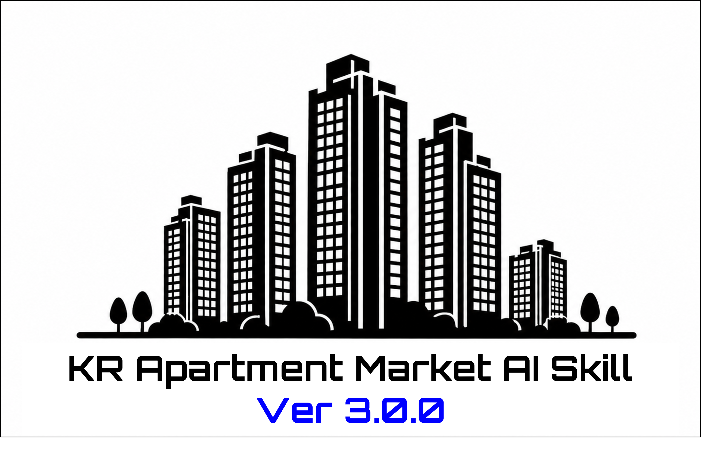

# KR Apartment Market AI Skill v3.0.0

대한민국의 공공 실거래 데이터를 근거로 사용자의 주거 선호를 구조화하고, **적합도가 높은 아파트 단지를 설명 가능한 점수로 추천한 뒤 현재 광고매물을 원문 플랫폼에서 확인하도록 연결하는 플랫폼 중립형 AI Home Finder**입니다.



> 이 프로젝트의 “최신”은 주식 체결가 같은 실시간 시세가 아니라, 국토교통부 등 원천 시스템에 최신으로 신고·공개된 데이터를 의미합니다. 광고가격은 실거래가가 아닌 호가이며, 두 값을 명확히 분리합니다.

- 소개 페이지: https://jtech-co.github.io/kr-apartment-market-skill/
- 저장소: https://github.com/JTech-CO/kr-apartment-market-skill
- 라이선스: MIT

## v3.0.0에서 달라진 점

v2.0.0의 국토교통부·청약홈 MCP 런타임과 아파트 시장 분석 기능은 그대로 유지하면서 다음 계층을 추가했습니다.

1. 자연어 주거 조건을 버전이 있는 `SearchProfile`로 정규화합니다.
2. 필수 조건, 선호 조건, 제외 조건과 가중치를 분리합니다.
3. 공공 실거래로 확인 가능한 가격·면적·연식·거래량·최근성·회복률을 결정론적으로 점수화합니다.
4. `match_score`와 `confidence_score`를 별도로 반환합니다.
5. 추천 이유, 양보해야 할 조건, 확인되지 않은 조건을 분리합니다.
6. 네이버 부동산, 당근 부동산, 피터팬, 아실, KB부동산 등의 원문 탐색 링크를 생성합니다.
7. 검색 프로필과 추천 실행 결과를 저장하고 후보·순위·가격·거래량 변화를 비교합니다.
8. 기존 17개 `kr_apartment.*` 도구에 15개 `kr_home.*` 도구를 추가했습니다.

## 해결하려는 문제

실거래 분석 서비스는 많지만 실제 주택 탐색 과정에서는 다음 작업이 다시 분리됩니다.

```text
내 조건 정리
→ 지역·단지 후보 찾기
→ 동일 면적 실거래 확인
→ 거래량과 가격 흐름 판단
→ 각 플랫폼에서 현재 매물 재검색
→ 후보를 다시 비교
```

v3.0.0은 이 흐름을 한 번의 AI 워크플로로 묶습니다. 단, 제3자 플랫폼의 광고매물을 복제하는 통합 매물 데이터베이스가 아니라 **추천과 공공데이터 분석은 자체 수행하고, 광고매물은 원문 확인 경로를 연결하는 구조**입니다.

## 사용 예시

```text
용인 수지구와 성남 분당구에서 매매 9억 원 이하 아파트를 찾아줘.
전용 74~86㎡, 준공 20년 이내를 선호하고 최근 거래가 너무 적은 단지는 피하고 싶어.
판교 출퇴근과 초등학생 자녀가 있지만 통근·학군 데이터가 없으면 추정하지 말고 미확인으로 표시해줘.
추천 이유와 부족한 조건, 최근 실거래, 네이버·당근·피터팬·아실·KB 원문 링크를 같이 보여줘.
```

권장 응답 구조:

```text
1. 해석된 조건 확인
2. 필수 조건 위반 후보 제외
3. 적합도·신뢰도 기준 상위 단지
4. 단지별 공식 실거래 근거
5. 추천 이유·트레이드오프·미확인 항목
6. 광고매물 원문 확인 링크
7. 최신성·표본·취소 거래 주의사항
```

## 핵심 설계 원칙

### 1. 공공데이터가 추천의 기준

단지 추천과 시장 지표는 국토교통부 실거래 등 이용 권한이 명확한 원천을 기준으로 계산합니다. AI가 현재 가격을 내부 기억으로 추측하지 않습니다.

### 2. 필수 조건과 선호 조건 분리

- **필수 조건**: 위반 시 후보 제외
- **선호 조건**: 충족 정도를 점수에 반영
- **제외 조건**: 명시적 위험·비선호 대상 제거
- **미확인 조건**: 임의 추정하지 않고 데이터 신뢰도에 반영

### 3. 점수와 신뢰도 분리

```json
{
  "match_score": 87.6,
  "confidence_score": 78.0,
  "strengths": ["예산 범위 충족", "희망 면적 거래 존재"],
  "tradeoffs": ["희망 연식보다 오래됨"],
  "unknowns": ["통근시간 데이터 미연결", "세대당 주차 미확인"]
}
```

### 4. 실거래와 광고가격 분리

- 실거래: 계약·신고된 공식 거래
- 광고가격: 매도자·임대인이 제시한 호가
- 광고매물 링크: 원문 플랫폼에서 현재 상태를 확인하기 위한 경로

### 5. 링크 우선 정책

기본 접근 모드는 `LINK_OUT_ONLY`입니다.

```text
허용: 플랫폼 홈·지역 지도·검증된 원문 URL 연결
금지: 비공식 API를 통한 대량 수집, 전체 매물 복제, 사진·설명·연락처 저장
확장: 공식 계약·서면 허가·정식 API가 있을 때만 메타데이터 표시 활성화
```

## 지원하는 데이터와 링크 원천

### 공공데이터 런타임

- 아파트 매매·전세·월세
- 오피스텔 매매·전세·월세
- 연립·다세대 매매·전세·월세
- 단독·다가구 매매·전세·월세
- 상업·업무용 매매
- 청약 공고·청약 통계

### 기본 광고매물·분석 링크

| 원천 | 기본 역할 | 기본 접근 모드 |
|---|---|---|
| 네이버 부동산 | 주거·상업·토지 광고매물 원문 확인 | `LINK_OUT_ONLY` |
| 당근 부동산 | 지역 지도와 직거래·중개매물 확인 | `LINK_OUT_ONLY` |
| 피터팬 | 주거 광고매물 원문 확인 | `LINK_OUT_ONLY` |
| 아실 | 아파트 단지·지역 분석 교차 확인 | `LINK_OUT_ONLY` |
| KB부동산 | 시세·실거래·광고매물 교차 확인 | `LINK_OUT_ONLY` |

추가 등록 원천: 다방, 직방, 디스코, 밸류맵, 땅야, 온비드.

## 설명 가능한 추천 점수

기본 가중치:

| 구성 요소 | 가중치 | 기본 데이터 원천 |
|---|---:|---|
| 예산 적합도 | 25% | 공공 실거래 |
| 면적 적합도 | 15% | 공공 실거래 |
| 거래 유동성 | 12% | 공공 실거래 |
| 최근성 | 10% | 공공 실거래 |
| 건축 연식 | 8% | 공공 실거래 보조 필드 |
| 최고가 회복률 | 7% | 파생 지표 |
| 전세 안전성 | 5% | 파생 지표 |
| 통근 | 8% | 선택형 enrichment |
| 교육 | 4% | 선택형 enrichment |
| 주차 | 3% | 선택형 enrichment |
| 매물 가용성 | 3% | 승인 데이터 또는 사용자 입력 |

가중치는 프로필별로 변경할 수 있으며 입력값은 합계 1로 정규화됩니다. 통근·교육·주차·현재 매물 수처럼 원천이 연결되지 않은 항목은 점수를 지어내지 않습니다.

## MCP 도구

### 기존 시장 분석 도구 17개

```text
kr_apartment.resolve_location
kr_apartment.get_transactions
kr_apartment.search_complexes
kr_apartment.get_complex_snapshot
kr_apartment.compare_complexes
kr_apartment.get_region_pulse
kr_apartment.rank_complexes
kr_apartment.get_signal_feed
kr_apartment.get_data_freshness
kr_apartment.get_source_link
kr_apartment.calculate_loan_payment
kr_apartment.calculate_compound_growth
kr_apartment.calculate_monthly_cashflow
kr_apartment.get_watchlist
kr_apartment.upsert_watchlist_item
kr_apartment.delete_watchlist_item
kr_apartment.get_watchlist_brief
```

### Home Finder 도구 15개

```text
kr_home.validate_search_profile
kr_home.create_search_profile
kr_home.get_search_profile
kr_home.update_search_profile
kr_home.delete_search_profile
kr_home.recommend_complexes
kr_home.explain_complex_match
kr_home.compare_candidates
kr_home.find_listing_links
kr_home.get_listing_source_capabilities
kr_home.inspect_listing_url
kr_home.save_search
kr_home.get_saved_searches
kr_home.delete_saved_search
kr_home.get_search_updates
```

기본 canonical 도구는 총 32개입니다. `ENABLE_REAL_ESTATE_MCP_COMPAT=true`이면 저장소 안에 포함된 `real-estate-mcp` 호환 도구 16개도 같은 서버에 등록됩니다.

## 빠른 시작

### 요구사항

- Python 3.11 이상
- `uv` 권장
- 공공데이터포털 국토교통부 실거래 API 키
- 청약 도구 사용 시 ODCloud 키

### 설치

```bash
git clone https://github.com/JTech-CO/kr-apartment-market-skill.git
cd kr-apartment-market-skill
cp .env.example .env
# .env에 API 키 입력
uv sync --extra dev
```

### 도구 목록 확인

```bash
uv run kr-apartment-market --list-tools
```

### stdio MCP 실행

```bash
uv run kr-apartment-market --transport stdio
```

### Streamable HTTP 실행

```bash
uv run kr-apartment-market \
  --transport streamable-http \
  --host 127.0.0.1 \
  --port 8765
```

### 테스트와 정적 검증

```bash
uv run pytest
uv run python scripts/validate_package.py . --write-manifest
```

라이브 API 키가 없어도 fixture 기반 런타임 테스트와 패키지 검증을 실행할 수 있습니다.

## 저장 구조

개인용 기본 모드는 로컬 JSON을 사용합니다.

```text
.data/watchlist.json
.data/home_finder.json
```

공개 서비스·다중 사용자 환경에서는 `database/schema.sql`과 다음 migration을 적용합니다.

```text
database/migrations/002_real_estate_mcp_integration.sql
database/migrations/003_home_finder.sql
```

v3 DB 계층:

```text
finder/
├─ 검색 프로필과 버전
├─ 저장 검색과 실행 이력
├─ 추천 후보
└─ 점수 구성 요소

listing/
├─ 원천 레지스트리
├─ 접근 정책
├─ 원문 탐색 링크
├─ 사용자 제공 URL
├─ 허가된 매물 observation
└─ 중복 클러스터·변경 이벤트
```

## 저장소 구조

```text
kr-apartment-market-skill/
├── README.md
├── PRD.md
├── SKILL.md
├── MCP_TOOL_SPEC.md
├── RELEASE_NOTES-v3.0.0.md
├── index.html
├── agents/
├── database/
│   └── migrations/003_home_finder.sql
├── docs/
│   ├── HOME_FINDER_ARCHITECTURE.md
│   ├── SCORING_MODEL.md
│   ├── LISTING_SOURCE_POLICY.md
│   └── MIGRATION_v2_TO_v3.md
├── evals/
├── mcp/tool-definitions.json
├── references/
├── scripts/
├── src/
│   ├── kr_apartment_market/
│   │   └── home/
│   └── real_estate/
└── tests/runtime/
```

## 책임 범위

이 프로젝트는 다음을 보장하지 않습니다.

- 미래 가격 또는 투자 수익
- 대출 승인, 세금, 감정평가 결과
- 제3자 플랫폼 광고매물의 실제 계약 가능 상태
- 광고 내용의 진실성이나 중복 여부
- 미연결 통근·학군·주차 데이터의 추정값

주택 탐색을 돕는 근거 기반 의사결정 보조 도구이며, 최종 확인과 계약 판단은 사용자·중개사·전문가가 수행해야 합니다.

## 라이선스와 제3자 고지

프로젝트 자체는 MIT 라이선스입니다. 통합된 `tae0y/real-estate-mcp`의 MIT 저작권 고지는 `THIRD_PARTY_NOTICES.md`, `licenses/`, `src/real_estate/LICENSE`에 보존되어 있습니다.

MIT는 이 저장소의 코드를 사용할 권한을 제공하지만, 네이버·당근·피터팬·아실·KB부동산 등의 매물 데이터, 사진, 설명, 상표 또는 연락처를 재사용할 권한까지 제공하지 않습니다.
