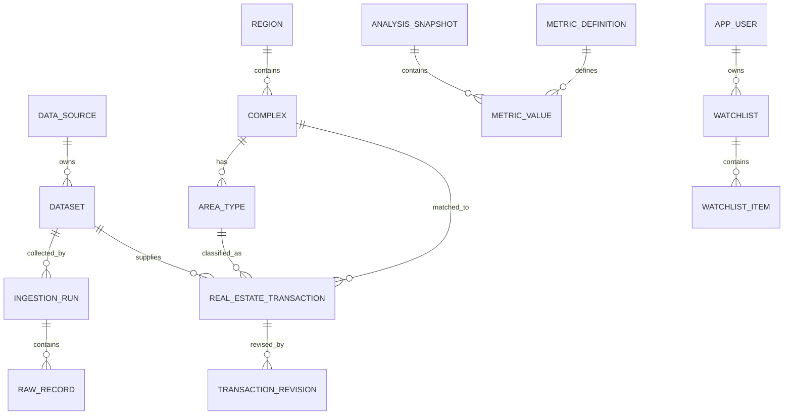

# KR Apartment Market 데이터베이스 설계

- 문서 버전: 1.0.0
- 데이터베이스: PostgreSQL 16+
- 기준일: 2026-08-18
- DDL: `database/schema.sql`
- 기준 데이터: `database/seed.sql`

## 1. 설계 목표

데이터베이스는 다음 요구를 동시에 만족해야 한다.

1. 공개 API 원본과 정규화 거래를 분리한다.
2. 취소·정정 이력을 물리 삭제 없이 재현한다.
3. 단지명 문자열이 아니라 안정적 UUID로 분석한다.
4. 면적 타입과 기간을 명시해 잘못된 비교를 막는다.
5. 산식 버전과 계산 근거를 저장한다.
6. 원천별 수집·캐시·파생·재배포 권한을 데이터 수준에서 통제한다.
7. 공개 시장 데이터와 OAuth 사용자 관심 목록을 격리한다.
8. MCP 감사 로그에 자연어 질의나 전체 응답을 저장하지 않는다.

## 2. 논리 계층

```text
ref        원천·데이터셋·지역·링크 규칙
ingest     수집 실행·원본 레코드·파티션 최신성·품질 이슈
market     단지·면적 타입·정규화 실거래·revision·외부 ID 매핑
analytics  산식·스냅샷·지표 값·신호·순위·변경 이벤트
app        OAuth 내부 사용자·관심 목록·멱등 키·배달 커서
audit      MCP 도구 호출과 사용자 쓰기 작업의 최소 감사 로그
```

## 3. 데이터 흐름

```text
공공 API / 승인 파트너 API
  ↓
ingest.ingestion_run
  ↓
ingest.raw_record             원본 불변 보존
  ↓ parser + resolver
market.real_estate_transaction 현재 정규 상태
  └─ market.transaction_revision 변경 이력
  ↓ deterministic metric engine
analytics.analysis_snapshot
  ├─ analytics.metric_value
  ├─ analytics.signal_event
  ├─ analytics.ranking_run / ranking_entry
  └─ analytics.entity_change_event
  ↓
MCP read tools / OAuth watchlist brief
```

## 4. 핵심 엔티티 관계



Mermaid를 지원하지 않는 환경에서는 위 관계를 표 설명으로 대체한다.

## 5. 식별자 전략

### 5.1 내부 ID

- 비즈니스 엔티티: UUID
- 대량 append-only 원본: `bigint identity`
- 사용자가 보는 ID: UUID 또는 opaque string
- OAuth 사용자: 내부 UUID

### 5.2 외부 ID

원천 ID는 `market.external_entity_map`에 저장한다. 외부 ID를 내부 PK로 사용하지 않는다. 원천이 변경되거나 동일 단지에 여러 식별자가 존재할 수 있기 때문이다.

### 5.3 거래 식별

`market.real_estate_transaction`은 다음 두 키를 구분한다.

- `source_record_key`: 해당 데이터셋 안에서 결정적으로 생성한 현재 레코드 키, unique
- `natural_key_hash`: 날짜·단지·면적·가격·층 등 정합성 검사용 SHA-256, non-unique

동일 조건의 실제 복수 계약이 존재할 수 있으므로 natural hash를 유일키로 강제하지 않는다. 원천의 순번 또는 결정적 occurrence index를 `source_record_key`에 포함한다.

## 6. 스키마별 테이블

## 6.1 `ref`

### `ref.data_source`

원천의 이용 권한을 코드가 아니라 데이터로 통제한다.

핵심 필드:

- `source_code`
- `access_mode`
- `can_ingest`
- `can_cache`
- `can_redistribute`
- `can_derive`
- `authorization_reference`
- `authorization_verified_at`
- `allowed_hosts`

`LINK_OUT_ONLY`는 모든 데이터 사용 권한 플래그가 `false`여야 한다. 아파트Me 기본 row가 여기에 해당한다.

### `ref.dataset`

하나의 원천이 제공하는 논리 데이터셋이다. 아파트 매매와 아파트 전월세는 분리한다.

### `ref.region`, `ref.region_alias`

법정동·행정동·시군구 계층과 검색 별칭을 관리한다. API의 `LAWD_CD`에 필요한 앞 5자리 코드를 별도 보관한다.

### `ref.source_link_rule`

`get_source_link`가 사용할 검증된 HTTPS 템플릿과 allowlist host를 저장한다. 임의 URL 조합을 허용하지 않는다.

## 6.2 `ingest`

### `ingest.ingestion_run`

데이터셋·지역·계약월 단위 수집 실행이다. 성공·부분 성공·실패와 원천 watermark를 기록한다.

### `ingest.raw_record`

원천 레코드의 JSON 표현을 불변 보존한다. XML 원문 전체를 한 행에 넣기보다 파싱 전 레코드 단위 JSON과 payload hash를 저장한다. 민감한 API 키·헤더는 제거한다.

### `ingest.dataset_partition_state`

`dataset × region × partition_key`별 마지막 성공 시각, 원천 watermark, 최신 계약일, 지연 상태를 저장한다. MCP `get_data_freshness`의 주요 원천이다.

### `ingest.data_quality_issue`

파싱·매핑·금액·날짜·중복·권한 문제를 기록한다. 자동 해결 여부와 운영자 검토 상태를 분리한다.

## 6.3 `market`

### `market.complex`

아파트 단지 마스터다. `complex_name`, 정규화명, 주소, 지역, 세대수, 준공일, 좌표를 저장한다. 이름만으로 unique 처리하지 않는다.

### `market.complex_alias`

과거명, 띄어쓰기 변형, 영문명, 원천별 표기를 검색에 사용한다.

### `market.area_type`

단지별 실제 전용면적 타입이다. 동일 전용면적이라도 타입 라벨이 다르면 분리할 수 있다. `(complex_id, area_type_id)` 복합 unique key를 두고 거래·분석·관심 항목이 다른 단지의 면적 타입을 참조하지 못하게 한다.

### `market.real_estate_transaction`

현재 유효 상태를 빠르게 조회하기 위한 정규화 거래 테이블이다.

- 금액은 KRW `bigint`
- 면적은 `numeric(8,2)`
- 계약일은 `date`
- 시각은 `timestamptz`
- 상태는 `VALID` 또는 `CANCELED`
- 품질 플래그는 `text[]`
- 매매가는 양수, 전세 보증금은 양수, 월세액은 양수로 강제
- `area_type_id`가 있으면 동일 `complex_id`에 속한 타입만 참조

### `market.transaction_revision`

거래가 최초 생성, 정정, 취소, 재활성화될 때마다 snapshot을 추가한다. 현재 행만 보고도 빠르게 조회할 수 있고 revision으로 과거 상태를 재현할 수 있다.

### `market.external_entity_map`

공공·민간 원천의 단지·지역 ID를 내부 UUID로 연결한다. 매핑 신뢰도와 수동 검증 여부를 보존한다.

## 6.4 `analytics`

### `analytics.metric_definition`

지표 코드, formula version, 단위, 최소 표본, 산식 설명을 저장한다. 산식이 바뀌면 row를 수정하지 않고 새 version을 추가한다.

### `analytics.analysis_snapshot`

단지 또는 지역, 면적 범위, 기간, 기준일, 필터, 신선도를 묶은 계산 실행 헤더다. `snapshot_key`는 동일 조건 재계산을 식별한다.

### `analytics.metric_value`

snapshot 안의 개별 지표 값과 표본, numerator/denominator, 상태, evidence를 저장한다. `OK`·`LOW_SAMPLE`·`PARTIAL_PERIOD`·`SOURCE_DELAYED` 상태에는 정확히 하나의 typed value가 있어야 하고, 계산 불가 상태에는 값이 없어야 하므로 `null`과 0이 섞이지 않는다.

### `analytics.signal_event`

신고가·거래 재개·단기 추세 후보의 시작, 활성, 종료, 철회를 기록한다.

### `analytics.ranking_run`, `analytics.ranking_entry`

지역·면적·기간·지표별 순위 계산을 재현한다. 순위 결과는 “투자 우수도”가 아니라 지정 지표 정렬이다.

### `analytics.entity_change_event`

관심 목록 브리핑용 변경 이벤트다. 신규·정정·취소 거래와 신호 시작·종료를 안정적 `dedup_key`로 기록한다.

## 6.5 `app`

### `app.app_user`

OAuth `issuer + subject`의 peppered hash만 저장한다. 이메일·실명은 기본 저장하지 않는다.

### `app.watchlist`, `app.watchlist_item`

사용자의 관심 단지 또는 지역과 면적·거래 유형·신호 조건을 저장한다. 항목 삭제는 soft delete이며 active natural key에 partial unique index를 적용한다.

### `app.idempotency_record`

관심 항목 쓰기 재시도를 안전하게 처리한다. 같은 key를 다른 payload에 재사용하면 충돌이다.

### `app.watchlist_delivery_cursor`

선택적 외부 알림 채널이 마지막으로 전달한 이벤트 위치다. `get_watchlist_brief` 읽기 호출은 이 값을 변경하지 않는다.

## 6.6 `audit`

### `audit.mcp_tool_call`

도구명, 상태, 지연시간, cache hit, 데이터셋 코드, 행 수 구간, 익명 상관 ID를 기록한다. 자연어 질문과 전체 결과는 저장하지 않는다.

### `audit.user_action`

관심 목록 추가·수정·삭제 등 명시적 쓰기를 기록한다. before/after 전체 개인정보 대신 최소 변경 요약을 저장한다.

## 7. 거래 업서트와 revision 절차

```text
1. raw_record 저장
2. source_record_key로 현재 거래 조회
3-A. 없음
     → transaction INSERT
     → revision_no=1, operation=INSERT
3-B. payload hash 동일
     → collected_at 또는 last_seen만 갱신 가능
     → revision 추가 안 함
3-C. payload hash 다름
     → 변경 필드 계산
     → transaction UPDATE
     → revision_no+1, operation=UPDATE/CANCEL/REACTIVATE
4. 영향받은 snapshot과 signal 재계산 큐 등록
5. entity_change_event 생성
```

업서트와 revision INSERT는 하나의 데이터베이스 트랜잭션에서 수행한다.

## 8. 취소·정정 처리

- 취소 거래를 삭제하지 않는다.
- `record_status=CANCELED`로 전환한다.
- `canceled_at`이 없으면 `null`을 유지한다.
- 기본 조회 view `market.v_active_transactions`는 `VALID`만 반환한다.
- 신고가·최고가·중위값·거래량을 재계산한다.
- 과거 신호가 더 이상 성립하지 않으면 `RETRACTED` 또는 `ENDED` 이벤트를 만든다.

## 9. 면적 모델

`area_type_id`가 존재하면 가장 강한 비교 키다. 원천 거래가 단지 타입에 매핑되지 않았어도 `exclusive_area_m2` 원본은 보존한다.

국민평형은 DB의 고정 enum이 아니라 분석 필터다.

```json
{
  "area_min_m2": 82.0,
  "area_max_m2": 86.0,
  "label": "전용 84㎡급"
}
```

## 10. 금액 모델

- 저장 단위: 원(KRW)
- 타입: `bigint`
- 공개 API가 만 원 단위이면 ×10,000 후 저장
- `price_krw`: 매매
- `deposit_krw`: 전세·월세 보증금
- `monthly_rent_krw`: 월세액

거래 유형과 맞지 않는 금액 필드는 `null`로 둔다. 0과 자료 없음을 구분한다. 매매가와 전세 보증금, 월세액 자체는 양수이며 월세 보증금만 0을 허용한다.

## 11. 인덱스 전략

### 검색

- `pg_trgm` GIN: 단지 정규화명, 별칭, 지역 경로
- 지역 계층: parent·level·유효기간

### 거래

- `(complex_id, contract_date DESC)` partial where `VALID`
- `(region_id, contract_date DESC)` partial where `VALID`
- `(complex_id, exclusive_area_m2, contract_date DESC)`
- `(dataset_id, source_record_key)` unique
- `contract_date`, `collected_at` BRIN for 대량 스캔

### 분석

- snapshot key unique
- scope/as-of indexes
- active signal partial index
- ranking run/entry compound index

### 관심 목록

- 사용자별 기본 watchlist partial unique
- active item natural key partial unique
- watchlist item ownership join index

## 12. 파티셔닝

V1은 단일 PostgreSQL과 일반 테이블로 시작한다. 다음 조건에 도달하면 월별 range partition을 검토한다.

- 거래 5천만 행 이상
- raw record 1억 행 이상
- vacuum 또는 월 범위 삭제가 운영 병목
- 계약월 기반 쿼리 대부분

우선 후보:

- `ingest.raw_record`: `collected_at` 월별
- `market.real_estate_transaction`: `contract_date` 연도 또는 월별
- `audit.mcp_tool_call`: `started_at` 월별

파티셔닝 전에는 실제 쿼리 계획과 운영 비용을 측정한다.

## 13. RLS와 소유권

`app` 사용자 테이블에는 Row Level Security를 적용한다. MCP 요청 트랜잭션에서 다음 값을 설정한다.

```sql
SET LOCAL app.current_user_id = '내부-user-uuid';
```

정책은 `app.current_user_id()`와 소유권을 비교한다. 사용자 테이블에는 `ENABLE`과 `FORCE ROW LEVEL SECURITY`를 함께 적용한다. 일반 API 연결은 테이블 owner 또는 `BYPASSRLS` 역할을 사용하지 않으며, 수집·마이그레이션 작업만 별도의 운영 역할을 사용한다. 공개 시장 테이블에는 RLS 대신 read-only 역할과 view를 사용한다.

## 14. 캐시와 재현성

- 공개 snapshot: Redis shared cache 가능
- 관심 목록: user-scoped cache
- 모든 분석 결과: `formula_version`, `as_of_date`, `source_watermark_at`, `filter_spec`
- 동일 `snapshot_key`는 같은 논리 조건을 의미
- 데이터 revision 후 이전 snapshot을 덮어쓸지 새로 만들지는 운영 모드에 따라 결정하되 `computed_at`과 데이터 watermark를 유지

권장 방식은 새 snapshot 생성 또는 `snapshot_key`에 data watermark hash를 포함해 과거 결과를 재현하는 것이다.

## 15. 보안

- DB에는 공공 API 서비스 키와 OAuth 토큰을 저장하지 않는다.
- URL template은 HTTPS allowlist만 허용한다.
- raw payload에서 인증 헤더·쿠키를 제거한다.
- app subject hash는 서버 비밀 pepper를 사용한다.
- audit에는 전체 질문·전체 결과를 저장하지 않는다.
- 관리자 수동 매핑은 변경 이력과 검증자를 기록한다.

## 16. 백업과 복구

권장:

- PostgreSQL PITR와 일일 base backup
- 원본 공개 API payload의 object storage 복제 선택
- `ref`, `market.complex`, `market.external_entity_map`, `app` 우선 복구 검증
- 월 1회 restore drill
- source 권한 registry는 별도 암호화 백업

## 17. 마이그레이션 원칙

- DDL은 migration tool로 순차 적용한다.
- enum 제거가 어려우므로 V1은 text + CHECK를 사용한다.
- 필수 필드 추가는 backfill 후 `NOT NULL`로 전환한다.
- metric formula 변경은 update가 아니라 version insert다.
- source access 권한 변경은 승인 로그와 함께 적용한다.
- destructive migration은 사전 snapshot과 rollback SQL을 준비한다.

## 18. 대표 쿼리

### 18.1 단지·면적 최근 유효 거래

```sql
SELECT contract_date, price_krw, exclusive_area_m2, floor
FROM market.v_active_transactions
WHERE complex_id = :complex_id
  AND trade_type = 'SALE'
  AND exclusive_area_m2 BETWEEN :area_min AND :area_max
ORDER BY contract_date DESC, transaction_id DESC
LIMIT 20;
```

### 18.2 최근 90일 중위가

```sql
SELECT percentile_cont(0.5) WITHIN GROUP (ORDER BY price_krw) AS median_price
FROM market.v_active_transactions
WHERE complex_id = :complex_id
  AND trade_type = 'SALE'
  AND contract_date BETWEEN :as_of_date - INTERVAL '89 days' AND :as_of_date
  AND exclusive_area_m2 BETWEEN :area_min AND :area_max;
```

### 18.3 사용자의 active 관심 항목

```sql
BEGIN;
SET LOCAL app.current_user_id = :user_id;

SELECT *
FROM app.v_active_watchlist_item
ORDER BY updated_at DESC;

COMMIT;
```

## 19. 초기 운영 용량 가정

내부 계획값이며 실제 데이터 측정 후 조정한다.

| 항목 | 초기 가정 |
|---|---:|
| 전국 아파트 거래 정규 행 | 수천만 행 이내 |
| raw payload 평균 | 1~4KB/행 |
| 공개 snapshot TTL | 5~60분 |
| 거래 상세 기본 page | 50건 |
| 관심 목록 기본 한도 | 사용자당 100항목 |
| audit 보관 | 30~90일 |

## 20. 적용 순서

1. PostgreSQL 16 준비
2. `schema.sql` 실행
3. `seed.sql` 실행
4. region master 적재
5. 공공 API fixture 수집
6. 단지 resolver 적재
7. 거래 증분 파이프라인 연결
8. metric engine 연결
9. MCP read tools 연결
10. OAuth·RLS 기반 watchlist 활성화

## 21. 수용 기준

- [ ] 전체 DDL이 깨끗한 PostgreSQL 16에서 한 번에 실행됨
- [ ] seed를 두 번 실행해도 중복 생성되지 않음
- [ ] `LINK_OUT_ONLY` 권한 제약 위반 INSERT가 실패함
- [ ] 취소 거래가 active view에서 제외됨
- [ ] revision으로 이전 상태를 재현 가능
- [ ] 동일 이름 단지가 UUID로 분리됨
- [ ] metric formula version이 보존됨
- [ ] 다른 사용자의 watchlist가 RLS로 차단됨
- [ ] 삭제 도구 재시도가 멱등함
- [ ] audit에 자연어 질문과 토큰이 저장되지 않음
